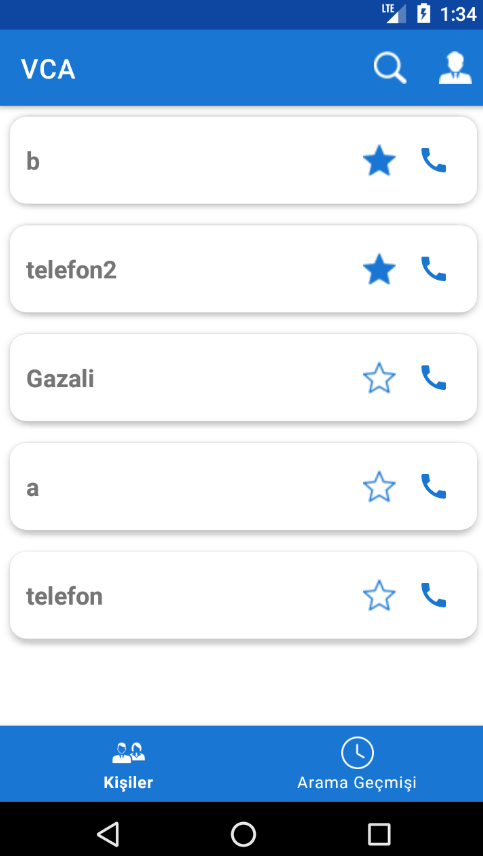
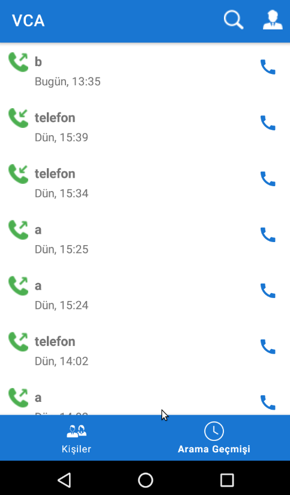
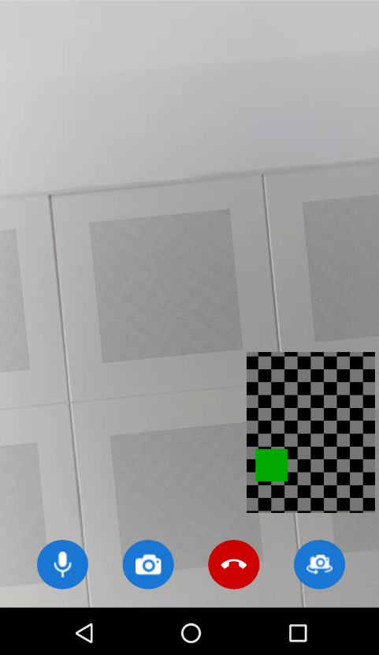
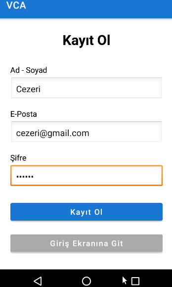
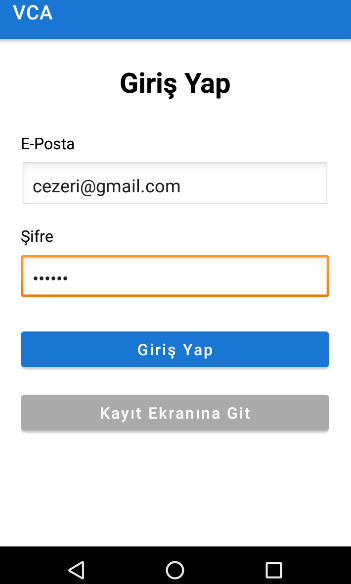

# JAVCA (Just Another Video Chat Application)

## Kullanılan Yazılımlar
* Java 17
* Android 23
* Javascript 22

## Çalıştırmak İçin
1. sudo ufw allow <PORT> numaraları girilerek sunucu ağdaki diğer cihazlar tarafından
erişilebilir olmalı. Varsayılanlar: 9099 (Auth), 9000 (Database)
2. firebase/start.sh ile firebase hizmetleri başlatılır.
3. firebase/saver.sh ile firebase verisi her varsayılan 5 dakika da bir kaydedilir.
4. firebase/functions klasörüne girip npm install yapmak gerek.
5. Android studio kullanılacaksa android klasörü import edilir.
6. android/app/src/main/res/xml/network_security_config.xml e sunucudaki firebase hostunun IP numarası eklenir.
7. android/app/src/main/java/com/sstek/javca/core/config/Config.kt dosyasına FIREBASE_HOST_IP = <Host IP numarası> olacak şekilde güncellenir.

Not: Aramaların algılanabilmesi için şimdilik uygulamanın arka planda açık olması gerek. 
Android in açık uygulamalar listesinde bu uygulama olmalı. Fakat önplanda farklı uygulamalar çalıştırılsa bile arama çalışıyor.

## Görseller
### Kişiler

### Arama Geçmişi

### Çağrı Ekranı

### Kayıt Ekranı

### Giriş Ekranı

## Özellikler
* Giriş, kayıt sistemi
* Favori ekleme, kişi arama
* Kilit ekranında bile bildirim alma (henüz görüntülü ekran gelmiyor)

